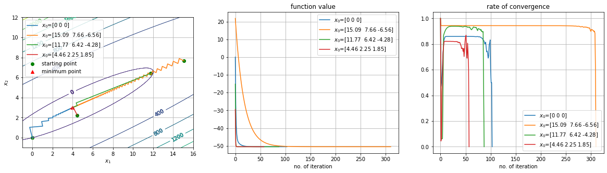
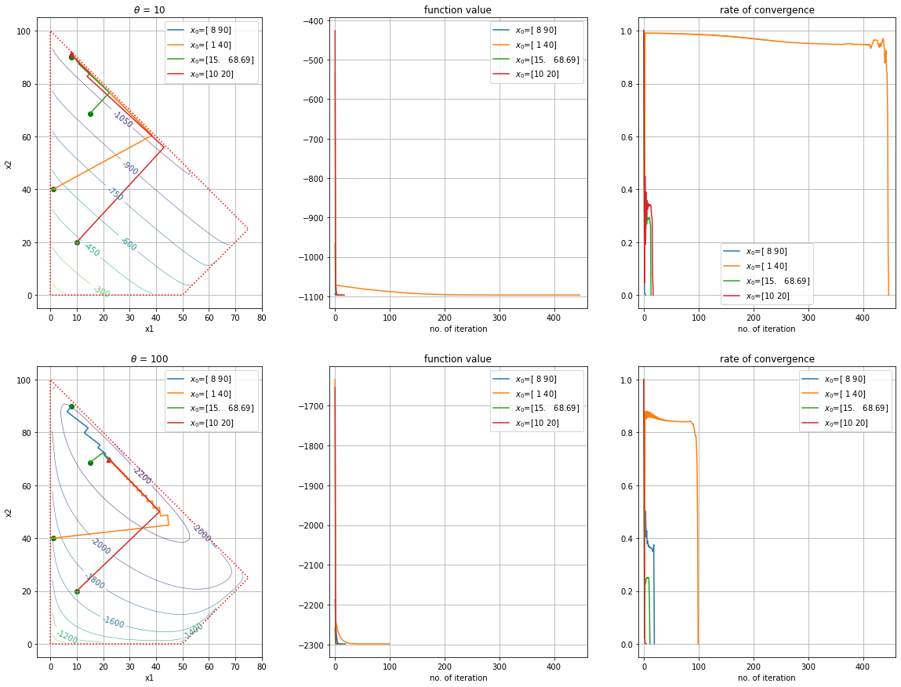

# JSOPT

202060410 정순규

This repository is for the programming homeworks of the Optimization Theory class, 2021 fall.

## HW#2 (due Oct. 14, 2021)

Prob 2. Minimization of a quadratic function using the steepest descent algorithm

Prob 3. Minimization of a function with log() using the steepest descent algorithm and the bisection algorithm

